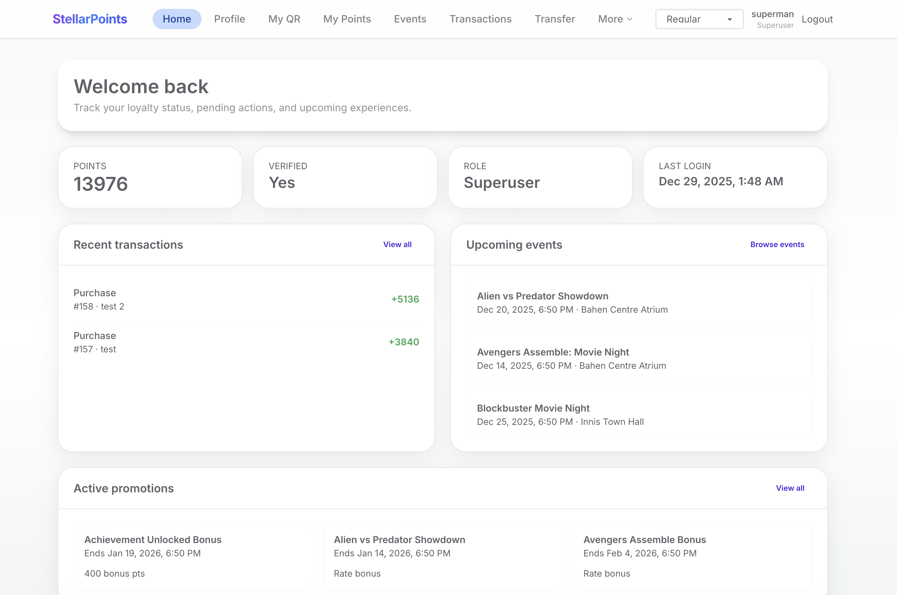
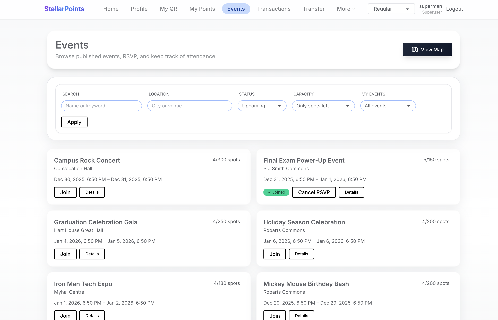
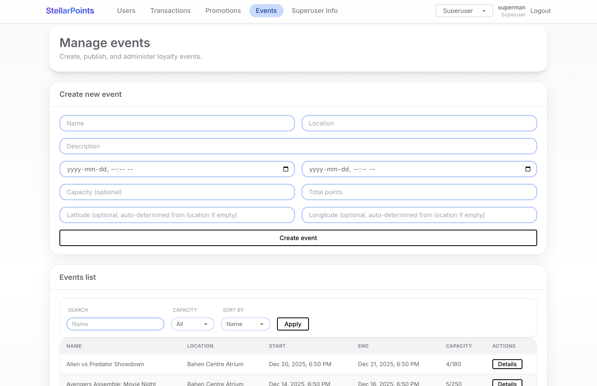

# StellarPoints

A comprehensive points-based reward system for managing user transactions, events, promotions, and more. StellarPoints provides role-based access control with interfaces for regular users, cashiers, managers, event organizers, and superusers.

## Screenshots

<div align="center">
  
  
  <br>
  
  
  <br>
  
</div>

## Features

### For Regular Users
**Example Regular Account:**
- **UTORid:** `neville1`
- **Password:** `1uta716eejnoa161vdsj3h2v1zvihny9`

- **Points Management**: View current points balance and transaction history
- **QR Code**: Generate and display personal QR code for point transactions
- **Events**: Browse and RSVP to events, view event details and locations
- **Interactive Map**: View all events on an interactive Google Maps interface with clickable markers
- **Promotions**: View available promotions and their terms
- **Transfers**: Send points to other users
- **Redemptions**: Redeem points for rewards
- **Profile Management**: Update personal information and reset password

### For Cashiers
**Example Cashier Account:**
- **UTORid:** `hermione`
- **Password:** `1uta716eejnoa161vdsj3h2v1zvihny9`

- **Transaction Processing**: Create new purchase transactions for customers
- **Redemption Processing**: Process point redemptions
- **Dashboard**: Quick access to transaction creation and processing tools

### For Event Organizers
**Example Organizer Account:**
- **UTORid:** `harrypot`
- **Password:** `1uta716eejnoa161vdsj3h2v1zvihny9`

- **Event Management**: Create, edit, and manage events you organize
- **Point Awards**: Award points to individual guests or all RSVP'd attendees
- **Event Details**: View comprehensive event information including guest lists
- **Event Analytics**: Track event capacity, points awarded, and attendance

### For Managers
**Example Manager Account:**
- **UTORid:** `yoda1234`
- **Password:** `1uta716eejnoa161vdsj3h2v1zvihny9`

- **User Management**: 
  - View all users with advanced filtering, sorting, and pagination
  - Update user roles (promote to cashier, etc.)
  - Verify users and mark suspicious accounts
  - Create new user accounts
- **Transaction Management**:
  - View all transactions across the system
  - Filter and sort transactions by various criteria
  - View detailed transaction information
  - Create adjustment transactions
  - Mark transactions as suspicious
- **Promotion Management**:
  - Create, edit, and delete promotions
  - View all promotions with filtering and sorting
  - Manage promotion schedules and terms
- **Event Management**:
  - Create, edit, and delete events
  - View all events with filtering and sorting
  - Add or remove users from events
  - Set event capacity and point values
  - Configure event locations with automatic geocoding

### For Superusers
- Full access to all manager features
- Complete system administration capabilities

## Technology Stack

- **Frontend**: React + Vite, Tailwind CSS, DaisyUI
- **Backend**: Node.js + Express.js
- **Database**: SQLite with Prisma ORM
- **Authentication**: JWT-based authentication
- **Maps**: Google Maps JavaScript API for event location visualization
- **State Management**: Zustand
- **Data Fetching**: React Query

## Getting Started

### Prerequisites
- Node.js 22+ (recommended: Node 22.11/22.12 via [`nvm`](https://github.com/nvm-sh/nvm))
- npm 10+
- SQLite3 CLI (for inspecting the local DB)

### Step 1: Install Dependencies

First, navigate to the project root directory and install dependencies for both backend and frontend:

```bash
# Navigate to the backend directory
cd backend

# Install backend dependencies
npm install

# Navigate to the frontend directory
cd ../frontend

# Install frontend dependencies
npm install
```

### Step 2: Environment Setup

1. Create a `.env` file in the `backend/` directory:
   ```bash
   # From the project root
   cd backend
   ```
   
   Create a `.env` file with the following content:
   ```env
   JWT_SECRET=your-secret-key-here-minimum-32-characters
   PORT=3000
   GOOGLE_MAPS_API_KEY=your-google-maps-api-key (optional, for geocoding)
   GOOGLE_GEOCODING_API_KEY=your-google-geocoding-api-key (optional)
   SEED_PASSWORD=DevStrongPass! (optional, defaults to DevStrongPass!)
   ```
   
   Generate a secure JWT_SECRET: `openssl rand -base64 32`

2. Initialize the database and seed demo data:
   ```bash
   # Make sure you're in the backend directory
   cd backend
   
   # Generate Prisma Client
   npx prisma generate
   
   # Push database schema (creates tables)
   npx prisma db push
   
   # Seed database with demo data (creates 30 users, 30 events, 30 promotions, 120+ transactions)
   npm run seed
   ```

### Step 3: Running the Application Locally

You need to run both the backend and frontend servers. Open two separate terminal windows:

**Terminal 1 - Backend Server:**
```bash
# Navigate to the backend directory
cd backend

# Start the backend server
npm run dev
```

The backend API will be available at `http://localhost:3000`

**Terminal 2 - Frontend Server:**
```bash
# Navigate to the frontend directory
cd frontend

# Start the frontend development server
npm run dev
```

The frontend will be available at `http://localhost:5173`

Open your browser and navigate to `http://localhost:5173` to access the application.

### Demo Credentials

After seeding the database, you can log in with these demo accounts (all share the same password):

**Superuser Account:**
- **UTORid:** `superman`
- **Password:** `1uta716eejnoa161vdsj3h2v1zvihny9`

**Example Regular User:**
- **UTORid:** `neville1`
- **Password:** `1uta716eejnoa161vdsj3h2v1zvihny9`

**Example Cashier:**
- **UTORid:** `hermione`
- **Password:** `1uta716eejnoa161vdsj3h2v1zvihny9`

**Example Manager:**
- **UTORid:** `yoda1234`
- **Password:** `1uta716eejnoa161vdsj3h2v1zvihny9`

**Example Event Organizer:**
- **UTORid:** `harrypot`
- **Password:** `1uta716eejnoa161vdsj3h2v1zvihny9`

> **Note:** The demo database includes 30 users, 30 events, 30 promotions, and 120+ transactions. All demo users share the same password as listed above.

### Building for production
```bash
cd frontend
npm run build    # outputs static assets in frontend/dist

cd ../backend
npm run start    # serves the API; configure a static host (Netlify, Vercel, etc.) for the frontend bundle
```

### Testing
- Frontend unit tests: `cd frontend && npm test`
- Backend tests / linters: `cd backend && npm test`
- End-to-end (Cypress): ensure both servers are running, then `cd frontend && npx cypress open`

## Deployment

**Note:** The application was previously deployed on Railway, but the free tier has expired. The deployment is no longer active. Below is documentation of how the application was deployed on Railway for reference.

### Previous Deployment: Railway

The application was deployed on Railway with automatic database initialization. The deployment consisted of two services: one for the backend API and one for the frontend.

#### Backend Deployment (Railway)

1. **Connect Repository:**
   - Created a new Railway project
   - Connected the GitHub repository
   - Selected the `backend/` directory as the root

2. **Configure Environment Variables:**
   In Railway dashboard → Backend Service → Variables:
   ```
   JWT_SECRET=<your-secure-secret-key>
   GOOGLE_MAPS_API_KEY=<your-google-maps-api-key> (optional)
   GOOGLE_GEOCODING_API_KEY=<your-geocoding-api-key> (optional)
   SEED_PASSWORD=<password-for-seeded-users> (optional)
   PORT=8080 (Railway sets this automatically)
   ```

3. **Build Configuration:**
   - Railway automatically detected Node.js projects
   - Build command: `npm install` (runs automatically)
   - Start command: `npm start` (runs `node src/server.js`)

4. **Database Initialization:**
   - The backend automatically initialized the database on startup
   - `src/initDb.js` runs `prisma generate`, `prisma db push`, and `npm run seed`
   - Database was recreated on each deployment (Railway's filesystem is ephemeral)

5. **Backend URL:**
   - Railway provided a public URL (e.g., `https://stellarbackend-production.up.railway.app`)
   - This URL was used for frontend configuration

#### Frontend Deployment (Railway)

1. **Create New Service:**
   - In the same Railway project, added a new service
   - Selected the `frontend/` directory as the root

2. **Configure Environment Variables:**
   In Railway dashboard → Frontend Service → Variables:
   ```
   VITE_API_BASE_URL=https://your-backend-url.railway.app
   VITE_GOOGLE_MAPS_API_KEY=<your-google-maps-api-key> (for map features)
   ```
   **Important:** These must be set BEFORE building, as Vite embeds env vars at build time.

3. **Build Configuration:**
   - Railway detected Vite projects automatically
   - Build command: `npm run build` (creates `dist/` folder)
   - Start command: `npx serve -s dist -l 8080` (serves static files)

4. **Redeploy After Env Changes:**
   - If `VITE_*` variables were changed, a redeploy was required
   - Vite embeds environment variables at build time, not runtime

### Alternative Deployment Options

**Backend:**
- Render, Fly.io, Heroku, DigitalOcean App Platform
- Ensure Node.js 22+ is supported
- Configure CORS to allow your frontend domain
- Set up persistent storage for SQLite (or migrate to PostgreSQL)

**Frontend:**
- Netlify, Vercel, Cloudflare Pages, AWS S3 + CloudFront
- Set `VITE_API_BASE_URL` in build environment variables
- Deploy the `dist/` folder as a static site

## Technology Stack & Architecture

### Frontend Technologies

- **React 18** - Modern UI library for building interactive user interfaces
- **Vite** - Fast build tool and development server
- **React Router** - Client-side routing and navigation
- **Tailwind CSS** - Utility-first CSS framework for rapid UI development
- **DaisyUI** - Component library built on Tailwind CSS
- **Zustand** - Lightweight state management for authentication and global state
- **React Query (TanStack Query)** - Powerful data fetching, caching, and synchronization
- **Google Maps JavaScript API** - Interactive map visualization for event locations

### Backend Technologies

- **Node.js 22+** - JavaScript runtime environment
- **Express.js** - Web application framework for RESTful APIs
- **Prisma ORM** - Modern database toolkit and query builder
- **SQLite** - Lightweight, file-based relational database
- **JWT (JSON Web Tokens)** - Secure authentication and authorization
- **bcrypt** - Password hashing for secure credential storage
- **Google Geocoding API** - Address to coordinates conversion for event locations

### Development Tools

- **ESLint** - Code linting and quality assurance
- **Cypress** - End-to-end testing framework
- **Git** - Version control

## Project Structure

```
Stellar_Points/
├── backend/                    # Backend API server
│   ├── prisma/
│   │   ├── schema.prisma      # Database schema definition
│   │   ├── seed.js            # Database seeding script
│   │   └── dev.db             # SQLite database file
│   ├── src/
│   │   ├── server.js          # Express server entry point
│   │   ├── app.js             # Express app configuration
│   │   ├── db.js              # Prisma client initialization
│   │   ├── initDb.js          # Database initialization script
│   │   ├── middleware/
│   │   │   └── auth.js        # JWT authentication middleware
│   │   ├── routes/
│   │   │   ├── authRoutes.js  # Authentication endpoints
│   │   │   ├── userRoutes.js  # User management endpoints
│   │   │   ├── eventRoutes.js # Event management endpoints
│   │   │   ├── promotionRoutes.js # Promotion endpoints
│   │   │   └── transactionRoutes.js # Transaction endpoints
│   │   └── helpers/
│   │       ├── clearance.js   # Role-based access control
│   │       ├── validation.js  # Input validation utilities
│   │       ├── geocoding.js   # Google Maps geocoding
│   │       ├── promoTx.js      # Promotion transaction logic
│   │       ├── rateLimit.js   # Rate limiting middleware
│   │       └── userQuery.js   # User query helpers
│   └── package.json
│
├── frontend/                   # React frontend application
│   ├── public/                # Static assets
│   ├── src/
│   │   ├── App.jsx            # Main application component
│   │   ├── main.jsx           # Application entry point
│   │   ├── components/
│   │   │   ├── Navbar.jsx     # Navigation bar component
│   │   │   ├── auth/          # Authentication components
│   │   │   ├── feedback/      # UI feedback components (toasts, spinners)
│   │   │   ├── layout/        # Layout components (AppShell)
│   │   │   ├── maps/          # Google Maps components
│   │   │   └── ui/            # Reusable UI components (Card, Modal, DataTable)
│   │   ├── pages/             # Page components
│   │   │   ├── DashboardPage.jsx
│   │   │   ├── LoginPage.jsx
│   │   │   ├── SignupPage.jsx
│   │   │   ├── UserEventsPage.jsx
│   │   │   ├── ManagerUsersPage.jsx
│   │   │   └── ... (20+ page components)
│   │   ├── lib/
│   │   │   ├── apiClient.js   # API client with JWT handling
│   │   │   ├── date.js        # Date formatting utilities
│   │   │   └── cn.js          # Class name utility
│   │   └── store/
│   │       └── authStore.js   # Zustand authentication store
│   ├── cypress/               # End-to-end tests
│   └── package.json
│
├── demo/                       # Demo screenshots
│   └── demo1-5.png           # Application screenshots
│
├── readme.md                   # This file
└── INSTALL                     # Detailed installation guide
```

### Key Architectural Patterns

- **RESTful API Design**: Backend exposes RESTful endpoints following standard HTTP methods
- **Role-Based Access Control (RBAC)**: Multi-level permission system (regular, cashier, organizer, manager, superuser)
- **Component-Based Architecture**: Frontend built with reusable React components
- **State Management**: Zustand for global auth state, React Query for server state
- **Database ORM**: Prisma provides type-safe database access and migrations
- **JWT Authentication**: Stateless authentication with secure token-based sessions

## Additional Information

For detailed setup instructions, deployment guides, and additional configuration options, see the `INSTALL` file.
